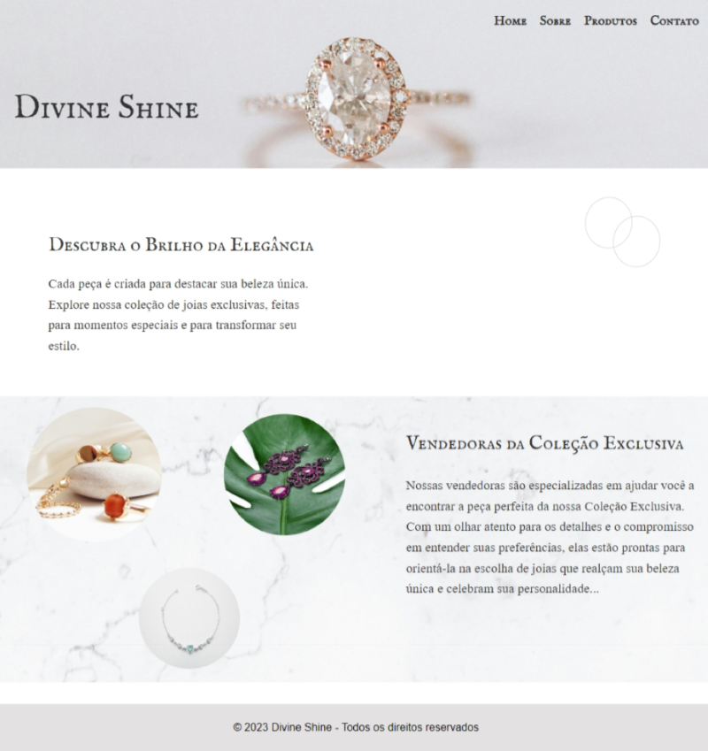

# 🌟 Divine Shine – Joias Exclusivas

## 📄 Documentação Técnica - Projeto Front-End

### 📝 Descrição do Projeto
**Divine Shine** é um site fictício de uma joalheria, desenvolvido como parte da disciplina de **Programação Front-End**.

O projeto tem como objetivo demonstrar a aplicação dos conhecimentos adquiridos sobre **HTML5, CSS3 e JavaScript**, explorando a criação de uma interface **elegante, responsiva e funcional**.

O foco foi oferecer uma **experiência visual agradável**, com navegação fluida e interatividade, alinhada às melhores práticas de desenvolvimento Front-End, **acessibilidade e SEO**.

---

## 🌐 Tecnologias e Ferramentas Utilizadas
- 🔹 **HTML5** – Estruturação semântica do conteúdo.
- 🔹 **CSS3** – Estilização, layout responsivo e efeitos visuais.
- 🔹 **JavaScript** – Interatividade, manipulação de eventos e validação de formulário.
- 🔹 **Media Queries** – Responsividade para diferentes dispositivos e tamanhos de tela.
- 🔹 **SEO Básico** – Meta tags, elementos semânticos e otimização de conteúdo.

---

## 📁 Arquitetura e Estrutura de Páginas

| Página          | Descrição                                                                 |
|-----------------|---------------------------------------------------------------------------|
| `index.html`    | Página inicial com apresentação da marca, banners e destaques.           |
| `sobre.html`    | Informações sobre a empresa, seus valores e missão.                      |
| `produtos.html` | Galeria de produtos com imagens, descrições e detalhes.                  |
| `contato.html`  | Formulário de contato funcional, com validação feita via JavaScript.     |

---

## 🧠 Funcionalidades e Recursos Implementados
- ✅ **Layout Responsivo:** Adaptação automática para desktop, tablet e mobile utilizando **Flexbox** e **Media Queries**.
- ✅ **Menu de Navegação:** Disponível em todas as páginas, com links funcionais e destaque no item ativo.
- ✅ **Formulário de Contato:**
  - Validação com **JavaScript** para garantir o preenchimento correto.
  - Mensagens de erro dinâmicas.
- ✅ **Interatividade com JavaScript:**
  - Efeitos de foco nos campos do formulário.
  - Alertas de confirmação de envio.
  - Realce em elementos de navegação.
- ✅ **SEO e Acessibilidade:**
  - Uso de `<meta>` tags (`title`, `description`, `viewport`, `charset`).
  - Estrutura semântica com `<header>`, `<main>`, `<section>`, `<footer>`, entre outros.
  - Atributos `alt` em imagens para acessibilidade.
- ✅ **Imagens Otimizadas:** Melhor performance e carregamento rápido.

---

## 🎨 Decisões de Design e Desenvolvimento
- Paleta de cores sofisticada, alinhada à proposta de uma marca de joias.
- Tipografia elegante, priorizando legibilidade e harmonia visual.
- Layout modular com hierarquia clara de informações.
- Navegação simples e intuitiva, com foco na **experiência do usuário**.
- Implementação de **responsividade mobile-first**.

---

## 🚧 Desafios e Soluções

| Desafio                                        | Solução Aplicada                                                                          |
|------------------------------------------------|-------------------------------------------------------------------------------------------|
| Garantir responsividade em todas as seções     | Uso combinado de **Flexbox** e **Media Queries**                                          |
| Validação de formulário sem bibliotecas externas | Implementação manual de funções **JavaScript**                                            |
| Otimizar imagens mantendo qualidade            | Compressão via ferramentas online e uso de formatos adequados (`.jpeg`, `.png`, `.svg`)   |
| Manter navegação fluida entre as páginas       | Criação de menus fixos e consistência na estrutura HTML                                   |

---

## 🎯 Objetivos Alcançados
- ✔️ Aplicação prática dos conceitos de **HTML5**, **CSS3** e **JavaScript**.
- ✔️ Desenvolvimento de um site completamente **responsivo**.
- ✔️ Implementação de **interatividade** básica com JavaScript.
- ✔️ Adoção de práticas de **SEO** e **acessibilidade**.
- ✔️ Entrega de um código **organizado, comentado e estruturado**.

---

## 📷 Capturas de Tela

---

## 👩‍💻 Autora

**Nayara Karine**  
Desenvolvedora Front-End em formação  
[LinkedIn](https://www.linkedin.com/in/nayarakarine-araujo/) | [GitHub](https://github.com/nayarakarinearaujo)

---

## 📜 Licença

Projeto desenvolvido para fins acadêmicos, sem fins comerciais.

### 🔗 Acessar o site Divine Shine
[Deploy](https://divineshine.vercel.app/)

